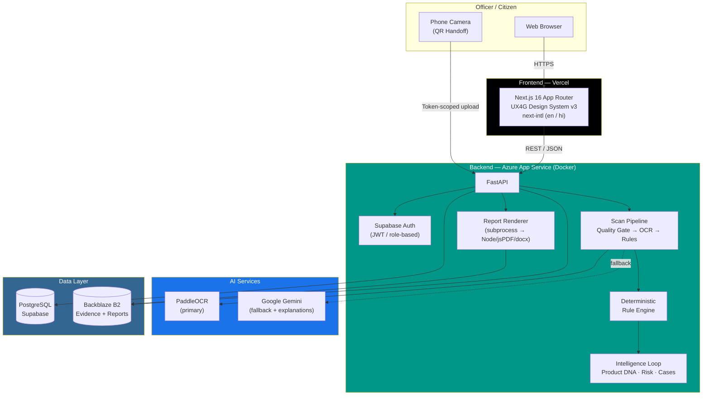

<div align="center">


# Digi-Pramaan

**AI-Powered Legal Metrology Compliance System**

Automated, evidence-backed compliance verification for packaged commodities — built for the **Department of Consumer Affairs, Ministry of Consumer Affairs, Food & Public Distribution**, Government of India.

[](docs/SIH26034.md)
[](LICENSE)
[](https://digipramaan.click)

[](https://nextjs.org)
[](https://react.dev)
[](https://www.typescriptlang.org)
[](https://fastapi.tiangolo.com)
[](https://www.python.org)
[](https://supabase.com)
[](https://azure.microsoft.com)
[](https://vercel.com)

[Live Demo](https://digipramaan.click) · [Problem Statement](docs/SIH26034.md) · [Design System](docs/Design.md) · [Report a Bug](../../issues)

</div>

---

## Table of Contents

- [The Problem](#the-problem)
- [The Solution](#the-solution)
- [Live Environment](#live-environment)
- [Key Features](#key-features)
- [System Architecture](#system-architecture)
- [Tech Stack](#tech-stack)
- [Repository Layout](#repository-layout)
- [Getting Started](#getting-started)
- [Testing & Quality Gates](#testing--quality-gates)
- [Deployment](#deployment)
- [Security & Compliance](#security--compliance)
- [Design Principles](#design-principles-worth-knowing)
- [Roadmap](#roadmap)
- [License](#license)

---

## The Problem

Packaged commodities sold across India's retail stores, supermarkets, and e-commerce platforms must, under the **Legal Metrology Act, 2009** and the **Legal Metrology (Packaged Commodities) Rules, 2011**, carry mandatory declarations — manufacturer/packer/importer identity, net quantity, Maximum Retail Price, month/year of manufacture, consumer-care details, and more — in a legally specified format, size, and placement.

Enforcement today is manual: an officer inspects a label, cross-checks a dozen rules by eye, and files a report by hand. At retail scale, this is slow, inconsistent, and leaves common violations — missing declarations, undersized MRP fonts, non-compliant net-quantity statements — under-detected.

**SIH Problem Statement [SIH26034](docs/SIH26034.md)** asks for a software system that scans product labels, images, and listings, and automatically detects, extracts, and validates these declarations against the 2011 Rules.

| | |
|---|---|
| **PS Number** | SIH26034 |
| **Organization** | Ministry of Consumer Affairs, Food & Public Distribution |
| **Department** | Department of Consumer Affairs (DoCA) |
| **Category** | Software |
| **Theme** | Agriculture, FoodTech & Rural Development |

## The Solution

**Digi-Pramaan** turns a photograph of a product label into a legally defensible compliance verdict:

```
Officer captures photos  →  Image quality gate  →  OCR extraction  →  Rule engine
       →  Officer review & correction  →  Immutable Verified record  →  Evidence-backed PDF/DOCX report
```

Every step is **deterministic and auditable** — the rule engine never fabricates a legal threshold it can't cite a source for, every AI-assisted step is labeled as decision-support only, and once an officer verifies a record it becomes immutable: the same report ID always regenerates the exact same byte-identical artifact.

## Live Environment

| Surface | URL | Notes |
|---|---|---|
| **Web app** | [digipramaan.click](https://digipramaan.click) | Next.js on Vercel, auto-deployed from `master` |
| **Backend API** | [digipramaan-backend-cfh2aubja6g8dqfz.centralindia-01.azurewebsites.net/docs](https://digipramaan-backend-cfh2aubja6g8dqfz.centralindia-01.azurewebsites.net/docs) | FastAPI on Azure App Service (Containers), Central India |
| **Report verification** | [digipramaan.click/verify/report/\[id\]](https://digipramaan.click) | Public, unauthenticated authenticity check for any issued report's QR code |

> The backend runs on a Basic-tier Azure App Service instance funded by an Azure for Students grant — expect it to scale accordingly, not production SLA.

## Key Features

### Scan & Verification Pipeline
Officer captures front/back/PDP photos (device camera, file upload, or a QR-code mobile handoff) → a real image-quality gate (blur, brightness, resolution, decodability) rejects unusable photos before they're ever stored → PaddleOCR (primary) with a Gemini fallback extracts every mandatory declaration → a **deterministic rule engine** checks each one against the Legal Metrology Rules, including barcode/GTIN cross-verification, font-height measurement for MRP and net-quantity text, and declaration placement/readability → the officer corrects and verifies, and the record becomes **immutable**.

### Legal-Safety by Construction
Rule 7 (font-height thresholds) has no officially validated legal source for its mm figures today — the system is built so it **cannot** print an authoritative "4mm required" unless a validated `RuleSetVersion` says so. It structurally can only reach `NEEDS_REVIEW`, printing an explicit "pending validated source confirmation" message instead of guessing. This isn't a UI warning bolted on top — the data model itself has no field capable of holding an unvalidated threshold.

### Evidence-Backed Regulatory Reports
Every verified record generates a forensic-quality PDF and a genuinely editable DOCX — not a screenshot dressed up as a document. Embedded original + cropped evidence photos, a 5-way compliance checklist (`PASS` / `FAIL` / `NEEDS_REVIEW` / `INSUFFICIENT_EVIDENCE` / `NOT_APPLICABLE`), dedicated Rule 7/8/9 sections, barcode evidence (showing *every* candidate when conflicting, never silently picking one), officer attestation, and a SHA-256 integrity block with a QR code linking to a public, unauthenticated verification page. Generated once, stored in Backblaze B2, and **never regenerated** — a re-download years later is byte-identical.

### Product Compliance DNA
Cross-inspection product identity resolved from a composite fingerprint (legal entity + brand + generic name + net quantity) — never a fuzzy auto-merge. Gives every product a full inspection timeline and recurring-violation history across every time it's been scanned, anywhere.

### Company Compliance Profile
Aggregate compliance rate, trend, violation distribution, and repeat-offender flags per legal entity — computed only from verified, jurisdiction-scoped records, never speculative data.

### Compliance Follow-Through
A real enforcement case workflow — `OPEN` → `ACTION_REQUIRED` → `REINSPECTION_REQUIRED` → `RESOLVED` → `CLOSED` — with a persisted, auditable status history, not a status field that silently overwrites its own past.

### Smart Risk (Enforcement Prioritization)
Deterministic, explainable rules flag records for enforcement attention — repeat same-category violations, multiple non-compliant products under one entity, open enforcement cases — each alert naming its exact rule, reason, score contribution, and supporting evidence records. Explicitly a **prioritization signal**, never a guilt determination; that authority stays with the rule engine's own verdict and the officer's judgment.

### E-Commerce Listing Scanner
Feed in a product listing URL and the same OCR/rule pipeline runs against its scraped images — extending compliance checking beyond physical shelf inspection to online marketplaces.

### Mobile QR Handoff
An officer on a laptop generates a QR code; a phone scans it and becomes the camera for that scan session in real time — no app install, backed by a real, token-scoped, time-limited upload session (never a same-server mock).

## System Architecture



**CI/CD:** every push to `master` triggers a GitHub Actions workflow that builds the backend's Docker image and pushes it to Azure Container Registry; the frontend redeploys automatically via Vercel's native Git integration. No manual deploy step in the loop.

## Tech Stack

<table>
<tr><td valign="top">

**Frontend**
- Next.js 16 (App Router)
- React 19 · TypeScript 5.9 (strict)
- UX4G Design System v3 — the mandatory, dependency-free component/token system for Government of India digital products
- next-intl — English + Hindi (scaffolded)
- react-hook-form + zod
- jsPDF + `docx` + `qrcode` — client-orchestrated report rendering
- Vitest + Testing Library + Playwright

</td><td valign="top">

**Backend**
- FastAPI (Python 3.11+)
- PostgreSQL via Supabase (Auth + DB)
- SQLAlchemy 2.0 + Alembic migrations
- Backblaze B2 (S3-compatible object storage) via boto3
- PaddleOCR (primary OCR) + OpenCV
- Google Gemini (OCR fallback, AI-assisted explanations)
- zxing-cpp (barcode/GTIN decoding)
- structlog · pytest

</td><td valign="top">

**Infrastructure**
- Vercel — frontend hosting, Git-triggered deploys
- Azure App Service (Linux Containers) — backend hosting
- Azure Container Registry
- GitHub Actions — Docker build/push CI
- Docker + docker-compose (local Postgres/MinIO)

</td></tr>
</table>

## Repository Layout

```
src/
  app/[locale]/       routes, locale-segmented (App Router)
  components/         ui/ layout/ sections/ and feature folders
  i18n/               next-intl routing, request config, navigation
  lib/api/            real-backend API clients
  lib/mock/           fixtures matching the real API shape (mock-mode)
  lib/server/         report-render-v2/ — the PDF/DOCX renderer
  messages/           en.json, hi.json
  styles/             tokens.css (generated), brand.css, typography.css
  types/              domain model, including the fixed vocabulary

backend/
  app/api/v1/         FastAPI routers — auth, scans, records, products,
                       companies, cases, dashboard, reports, mobile-handoff
  app/services/       rule engine, image quality, Product DNA, risk engine,
                       intelligence loop, report generation
  app/jobs/           async pipeline + report generation orchestration
  app/db/models/      SQLAlchemy models
  alembic/            hand-authored migrations
  tests/              unit/ (no external deps) + integration/ (real dev DB/B2)
  Dockerfile          production container image

.github/workflows/    CI — builds and pushes the backend image on every push
docs/                 problem statement, BRD, UX4G design contract
Pages_Userflow/       the functional spec — source of truth for every page's
                       states and the fixed vocabulary
```

## Getting Started

### Prerequisites

- Node.js ≥ 20.9
- Python ≥ 3.11
- Docker (for local Postgres/MinIO, or to build the backend image)
- A Supabase project and a Backblaze B2 bucket for real-data mode (optional — mock mode needs neither)

### Frontend

```bash
npm install
npm run dev
```

Open `http://localhost:3000`. `NEXT_PUBLIC_USE_MOCK_DATA` defaults to `true`, serving realistic fixtures from `src/lib/mock/` — no backend required to explore the UI. Set it to `false` (see `.env.example`) and point `NEXT_PUBLIC_API_BASE_URL` at a running backend for real end-to-end data.

### Backend

```bash
cd backend
docker compose up -d              # local Postgres + MinIO (S3-compatible storage)
pip install -e ".[dev]"
cp .env.example .env              # fill in DATABASE_URL, S3_*, SUPABASE_*, GEMINI_API_KEY
alembic upgrade head
uvicorn app.main:app --reload --port 8000
```

Interactive API docs are then live at `http://localhost:8000/docs`.

### Docker (production-shaped)

```bash
cd backend
docker build -t digipramaan-backend .
docker run -p 8000:8000 --env-file .env digipramaan-backend
```

## Testing & Quality Gates

| Command | What it does |
|---|---|
| `npm run verify` | Runs the four gates below, in order — the required pre-commit check |
| `npm run verify:tokens` | Regenerates `tokens.css` from the installed UX4G package, fails on any fabricated `--ux4g-*` token |
| `npm run i18n:check` | Fails if `hi.json` has drifted out of step with `en.json` |
| `npm run typecheck` | TypeScript strict, zero errors |
| `npm run lint` | ESLint with `jsx-a11y` at error level, zero warnings |
| `npm test` | Vitest — component, vocabulary, and report-renderer tests |
| `npm run qa:visual -- /` | Screenshots a route at three widths, both themes |
| `pytest` (in `backend/`) | Unit tests — no external services required |
| `pytest -m integration` (in `backend/`) | Real integration tests against dev DB/B2 — each test creates and cleans up its own rows |

Current state: **297 backend unit tests**, **132 frontend Vitest tests**, all green — plus a dedicated integration suite validating real report generation, immutability (SHA-256 byte-identical redownload), and the full scan → OCR → rule-engine pipeline against real infrastructure.

`npm run verify:tokens` guards the rule that matters most in a UX4G codebase: the design system documents tokens under Figma-side names (`Background/Neutral/Default`), while the shipped CSS spells that `--ux4g-bg-neutral`. Guessing the CSS name from the Figma name is exactly how fabricated tokens creep in — the script checks every reference against the installed package instead.

## Deployment

| Component | Platform | Trigger |
|---|---|---|
| Frontend | Vercel | Git push to `master` (native GitHub integration) |
| Backend | Azure App Service (Web App for Containers) | GitHub Actions builds & pushes to Azure Container Registry on every push touching `backend/` |
| Database | Supabase (managed Postgres) | — |
| Object storage | Backblaze B2 | — |

The backend Dockerfile ships everything the pipeline needs at the system level — including `libgl1`/`libglib2.0-0` for OpenCV (a transitive PaddleOCR dependency) — so the container that CI builds is exactly what runs in production, no drift between "works on my machine" and what's deployed.

## Security & Compliance

- **Role-based access control** — every record, report, and case is scoped to the officer's jurisdiction; cross-jurisdiction access returns `404`, never a distinguishable `403`, so probing can't map what exists outside your scope.
- **Immutable audit trail** — a verified compliance record cannot be silently edited; corrections are logged, not overwritten.
- **No fabricated legal thresholds** — Rule 7 (font-height) is structurally incapable of stating an unvalidated mm figure as authoritative.
- **AI is decision-support only** — every AI-generated explanation is explicitly labeled "AI-assisted explanation — interpretive aid only"; the rule engine's deterministic verdict is always authoritative.
- **Private object storage** — evidence photos and reports live in a private Backblaze B2 bucket, served only through authenticated (or narrowly scoped, time-limited) backend endpoints — never a public bucket URL.
- **Report integrity** — every issued report carries a SHA-256 hash and a QR code resolving to a minimal, unauthenticated verification endpoint that confirms authenticity without exposing report contents.

## Design Principles Worth Knowing

**Role comes from the account, not a dropdown.** Login has no role selector — the backend returns the role with the session, and the UI reads it from there.

**English at launch, Hindi scaffolded.** Both locales route and both message files stay in step programmatically, but the language switcher only offers what's configured live.

**Fixed vocabulary is code, not convention.** Compliance statuses, roles, source tags, and violation categories are constants in `src/types/vocabulary.ts` — a test asserts the English message catalogue matches them verbatim.

**No Product foreign key on a compliance record.** A record's product/company association lives only in a link table, never a stored FK — correcting a mistaken product match supersedes the old link rather than rewriting a verified record.

**Risk is prioritization, never a verdict.** Smart Risk's score never shares a code path with the rule engine's own compliance status — a high risk score flags something for enforcement attention; it does not decide guilt.

## Roadmap

- [ ] Full audit-trail timeline (pipeline-stage-level events — OCR completed, evidence uploaded, etc.)
- [ ] Company/manufacturer cross-inspection context surfaced directly in the report
- [ ] Perspective/curvature-aware image quality checks
- [ ] Hindi translation completion
- [ ] Legally validated Rule 7 threshold source, to unlock automated PASS/FAIL

## License

Released under the [MIT License](LICENSE).

---

<div align="center">

Built for **Smart India Hackathon 2026** · Problem Statement [SIH26034](docs/SIH26034.md)

</div>
